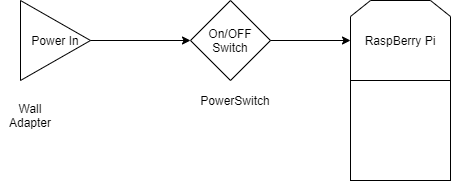

## Power requirements for Raspberry Pi 4 Model B

---
- Raspberry Pi 4 Model B requires a 15W power adapter that gives it A 5V minimum 3A current.
### 1. Voltage requirement
---
- The voltage level heavily relies on the power management IC (MXL7704) with an input voltage range of 4.0V to 5.5V and an absolute maximum rating of 6V that must not be exceeeded.
- USB ports connected to the Pi are directly connected to the 5V power rail. 
- Raspberry Pi triggers the low voltage warning at 4.63V with an allowance of 0.07V for USB 3.0
- The reasonable voltage range to power the Pi is therefore 4.7 to 5.25V
### 2. Current requirement
---
- Raspberry Pi 4 model b recommends a minimum of 3A current according to this [specification listing](https://www.raspberrypi.com/products/raspberry-pi-4-model-b/specifications/)
- Minimum required current is 2.5A if the connected peripherals consume less than 500mA in total

### 3. Throttling
- When the Raspberry Pi is operating at maximum power, a lot of heat is generated by the the processor. This in turn triggers a mechanism that reduces the clock speed if rated system temperature is exceeded. 
- To prevent or help reduce this, at 15W max power, we need heatsinks and an external fan that will reduce this throttling mechanism.

### 4. Powering sequence
---
- Pi does not come with an onboard switch button.
- Past booting procedure of the Pi requires that you shut down the OS and then unplug the power supply. 
- However, it has been found that this is a risky procedure.
- We will therefore build a power switch to be used as an ON/OFF button without having to unplug the Raspberry Pi
- The user has to note though that they still have to shut down the OS before switching off the power switch.

***illustration***

### Summary table
---
| Item No | Description | Min| Max |
| ----------- | ----------- | ---| ---|
| 1 | Voltage (V) | 4.67 | 5.25 |
| 2 | Current(A) | 2.5 | 3 |
| 3 | Power Consuption (W) | 3.4 (Idle)  | 7.6W (On-load) |

### Conclusion
---
- We could consider using a power bank like one used for smartphones but current available and affordable USB PD power banks deliver a max of 2.1A at 5V, which is way below the minimum operating current needed by the Pi.
- Based on the above requirements, a wall adapter that delivers 15W of power to the Pi would serve as a sufficient power supply unit (PSU). 
- Raspberry Pi delivers their own power adapter for required supply.

### References
---
1. [https://www.tomshardware.com/reviews/raspberry-pi-4](https://www.tomshardware.com/reviews/raspberry-pi-4)
2. [https://raspberrypi.stackexchange.com/questions/99961/powering-the-pi-4-safe-voltage-levels-and-current-requirements#:~:text=Raspberry%20Pi%204%20spec%20recommends,than%20500%20mA%20in%20total.](https://raspberrypi.stackexchange.com/questions/99961/powering-the-pi-4-safe-voltage-levels-and-current-requirements#:~:text=Raspberry%20Pi%204%20spec%20recommends,than%20500%20mA%20in%20total.)
3. [https://www.raspberrypi.com/products/raspberry-pi-4-model-b/specifications/](https://www.raspberrypi.com/products/raspberry-pi-4-model-b/specifications/)
